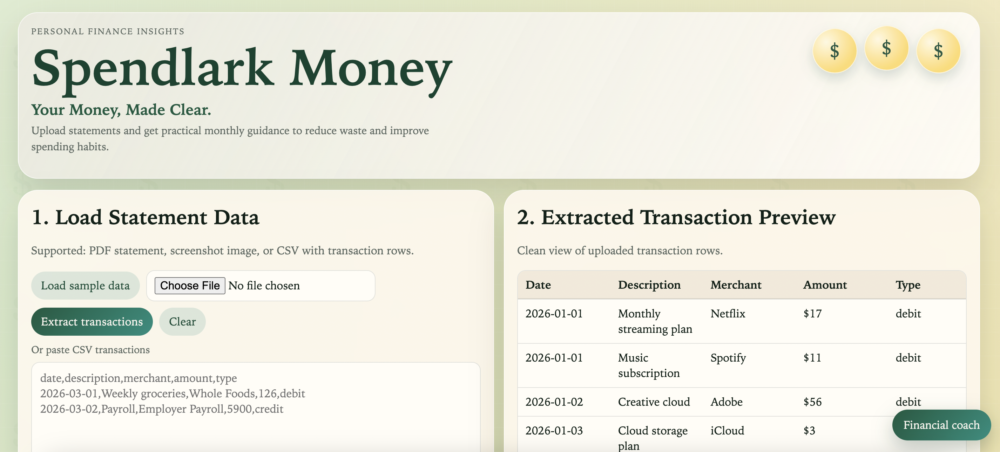
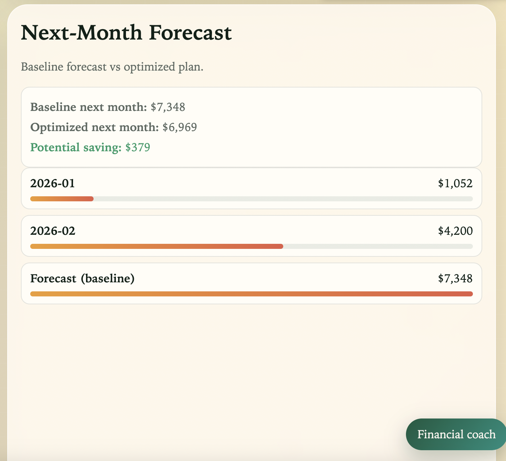
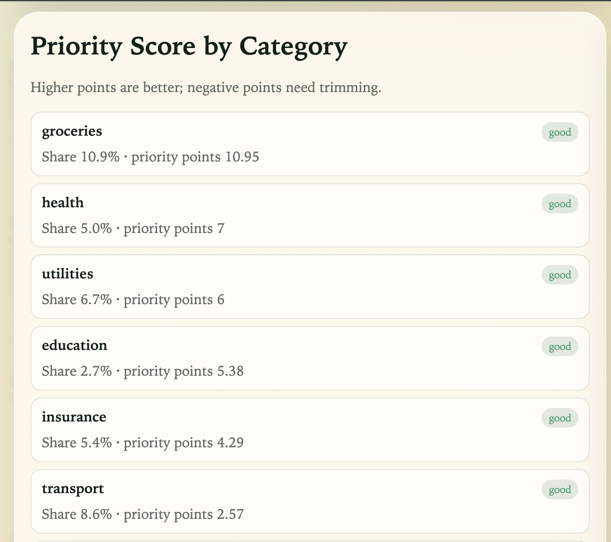
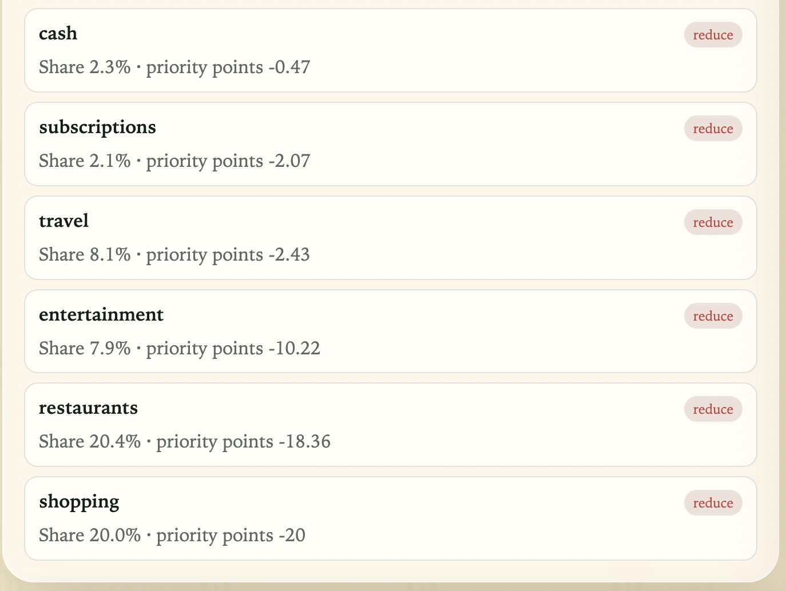
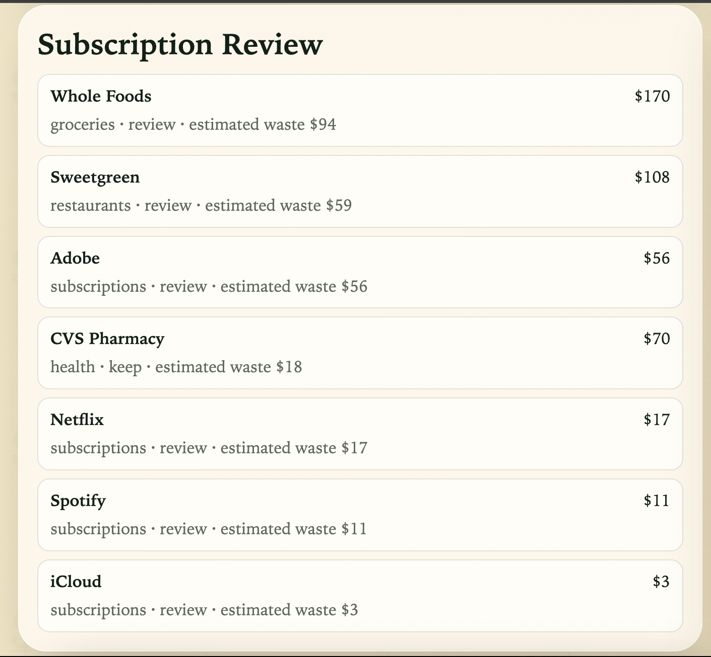
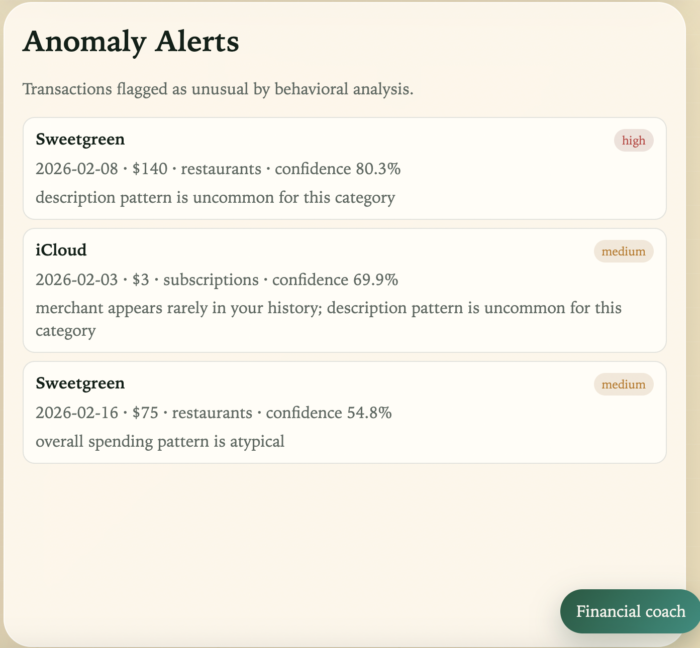
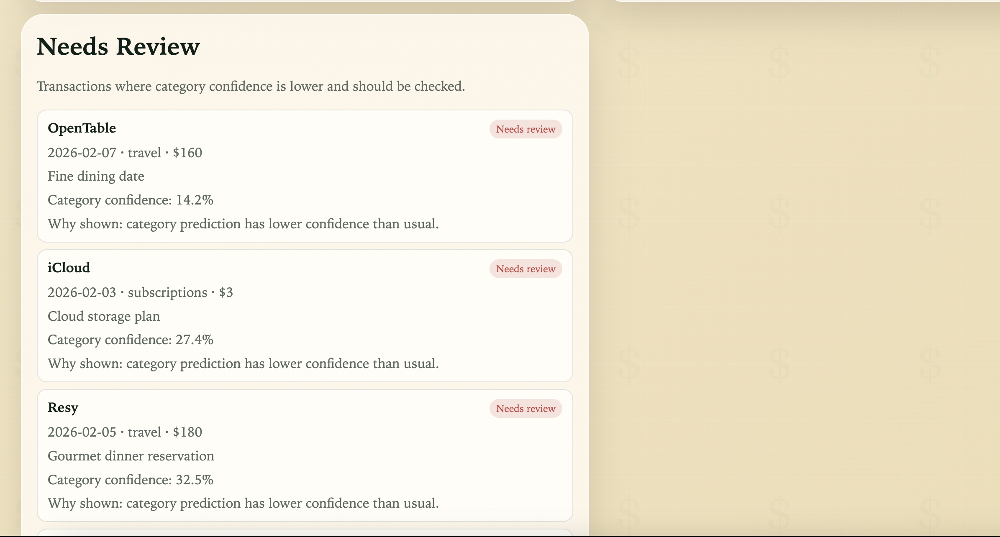
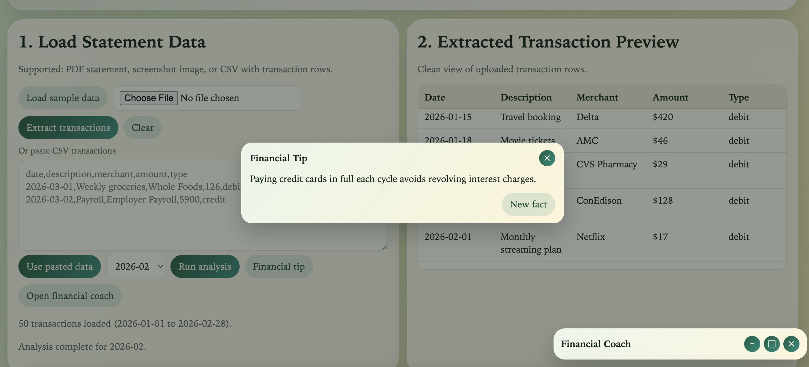
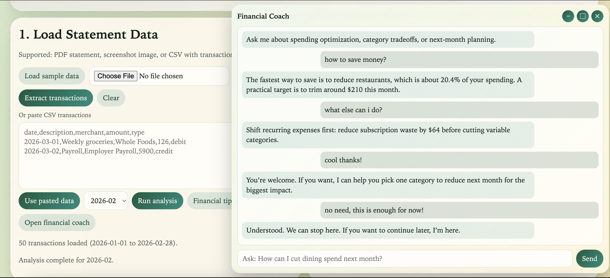

# Spendlark Money

Spendlark Money is a personal finance intelligence app that turns raw transaction statements into clear monthly insights, actionable recommendations, and guided coaching. My motivation for creating it comes from the fact that I am not always the most financially responsible person :( I might not spend more than $70 on a single item, but I end up buying 300 small things—and that adds up to way more than anything else :)))

## What This App Does
- Ingests transaction data from **PDF statements**, **screenshots**, and **CSV files**.
- Uses ML-powered analysis to categorize spend, detect patterns, flag unusual behavior, and forecast next-month outcomes.
- Provides a conversational **Financial Coach** (LangChain-enabled when configured) for personalized guidance.
- Surfaces rotating **Financial Tips/Facts** for practical money habits.

## Product Experience
### 1) Load Statement Data
Users can upload a file or paste CSV rows. The app standardizes records into a clean transaction format.

### 2) Extracted Transaction Preview
A readable transaction table helps users verify dates, merchants, amounts, and debit/credit types before analysis.

### 3) Monthly Snapshot
- **Monthly spending**: total spend for selected month.
- **MoM change**: month-over-month movement in spend.
- **Financial score**: an overall behavior score (0-10).
- **Subscription waste**: estimated recurring spend that may be low-value.

### 4) Category Spend
A ranked category breakdown showing where money went and each category share.

### 5) Priority Score by Category
Category-level signals to identify where to reduce first versus where to preserve long-term value spend.

### 6) Next-Month Forecast
Compares baseline projected spend with an optimized scenario, including potential improvement.

### 7) Subscription Review
Highlights recurring merchants and estimated monthly impact.

### 8) Anomaly Alerts
Flags unusual transactions with confidence scores to support faster review.

### 9) Needs Review
Shows low-confidence categorization rows for manual verification.

### 10) Financial Coach + Financial Tip
- **Financial Coach**: conversational, context-aware support based on current analysis.
- **Financial Tip**: rotating general finance fact/tip to keep users engaged with practical money habits.

## Screenshots
### 1) Webpage / Intro

### 2) Monthly Snapshot + Category Spend

### 3) Monthly Forecast Feature

### 4) Points by Category (Comparison)
| Spend Impact Positive | Spend Impact Negative|
|---|---|
|  |  |

### 5) Subscription Review

### 6) Anomaly Alerts

### 7) Needs Review

### 8) Financial Tip

### 9) Financial Coach

## Financial Coach (LLM + LangChain)
The coach is designed as a natural-language tutoring assistant:
- responds directly to what the user asks
- keeps tone friendly and practical
- adapts to recent conversation context
- can gracefully close when user indicates they are done

When LLM access is available, LangChain is used for richer responses. A robust fallback behavior layer keeps coaching usable even without external model access.

## Open-Source Data & ML Foundation
This project is built on open tooling and open dataset workflows:
- transaction categorization with classical ML pipelines
- anomaly detection on behavioral spend signals
- OCR + parsing for statement ingestion
- extensible dataset inputs under open-source-friendly workflows

Reference datasets and model notes are documented in:  
[`docs/open-source-datasets.md`](docs/open-source-datasets.md)

## What Makes It Different
- **Single unified workflow**: ingestion, analysis, recommendation, and coaching in one interface.
- **Action-focused insights**: not just charts; it highlights where to improve and why.
- **Behavior-aware design**: combines descriptive analytics with prioritization and next-month planning.
- **Human-style guidance**: financial coaching is conversational and user-intent aware.

## Why It Is Useful
- Helps users understand spending behavior quickly.
- Identifies avoidable leakage (especially recurring expenses).
- Gives a practical path to improve month-over-month financial discipline.
- Bridges data visibility and day-to-day decision making.

## Repository Structure
- `frontend/` - user interface (dashboard, coach window, tip modal, interactions)
- `backend/main.py` - API entrypoint and endpoints
- `backend/ml_engine.py` - spending analysis and ML inference pipeline
- `backend/coach_service.py` - financial coaching + LangChain integration layer
- `backend/statement_ingest.py` - PDF/image/CSV ingestion and normalization
- `backend/train_models.py` - model training utilities
- `backend/data/` - sample data
- `backend/models/` - trained model artifacts
- `docs/` - references for open datasets and model sources

## Tech Stack (Language Breakdown)
This repository is intentionally structured so GitHub language stats clearly reflect the system:
- **Python** - backend APIs, ML pipeline, coach orchestration
- **JavaScript** - frontend app logic and interactive behavior
- **HTML** - application structure
- **CSS** - visual design system and UI styling
- **Markdown** - project documentation

## Author
Built by **Shwetha Tinnium Raju**.
